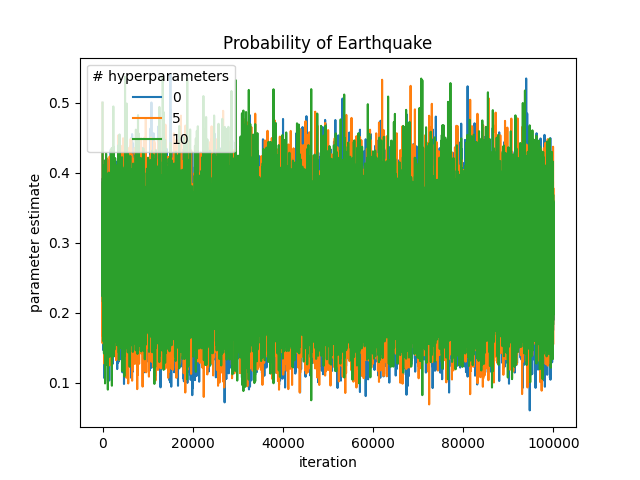

# Faculty Data

The following are figures representing the learning process for the faculty data.
The legend in each figure represents the number of hyperparameters that were used in generating the learning run.
You will notice the bug that variance estimates go off to inifinity over time.
Perhaps a bug. Or perhaps a manifestation of the second law of thermodynamics????
I decided to show the values throughout the training process because it allowed you to see the mixing as well as a rough estimate of the mean.
The main difference introduced by hyperparameters is that the variability of the mixing in the mean estimates is slightly tighter with more hyperparameters.

Variance Parameter:

Mean Parameter:

# Burglary Network

## Adjustments to the number of data points per estimated node:

The following are the mixing plots across time for four different estimated parameters from the network that were learned from varying amounts of data.
The number of data points included per estimated parameter is listed in the legend.
Varying the size of the dataset had a larger impact on the accuracy of the network than any other experiment (except varying the dataset used -- see the end of this file).
The main effect is a decrease in the mixing variance as a result of greater certainty about the true value of a parameter.
You can see this in the figures by the fact that the colors representing larger dataset are nested inside the colors representing smaller datasets.

 

 

## Adjustments to the number of hyper parameters on the priors:

As you might have guessed, varying the number of hyperparameters had little impact on the learnability of the parameters.
You will notice that increasing hte number of hyperparameters slightly decreased the variance in the mixing.
However, I am tempted to say that this effect might not even be statistically significant.

## Adjustments to the number of data nodes dropped:

Compared to varying the size of the dataset, adjusting the number % of data nodes associated with each learned parameter had a very small effect.
In one instance the mean of the mixing distribution shifted up, but in all other cases, it seems like the variance increases only slightly
as a result of dropping nodes.

I believe that this results from the fact that the main structure of the network is still largely preserved when only one or two nodes are dropped,
whereas when a whole "row" of data is dropped, any information about connections between nodes that was in that data is lost.
Losing entire rows is worse that losing the same number of nodes sparcely through the network.

## Adjustments in the dataset used (the old, "sparse" network or the new one):

